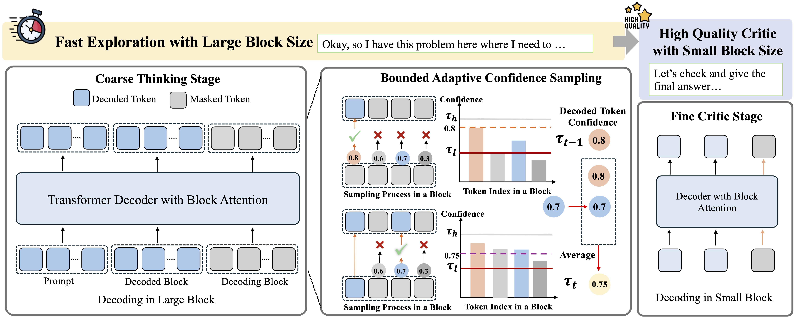
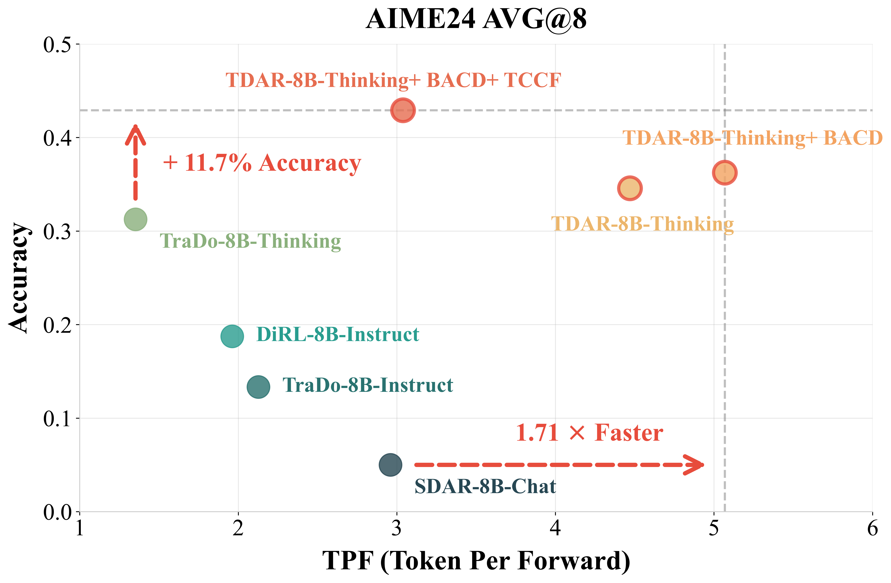

<div align="center">

<h1>
  Advancing Block Diffusion Language Models for Test-Time Scaling
</h1>

</div>

<br>

<p align="center">
  📃 <a href="https://arxiv.org/abs/2602.09555" target="_blank">Paper</a > • 🤗 <a href="https://huggingface.co/lulululuyi/TDAR-8B-Thinking" target="_blank">Model</a >
</p >

TDAR is a unified framework designed to unlock the potential of Block Diffusion Language Models (BDLMs) for test-time scaling on complex reasoning tasks. We introduce adaptive decoding and generation strategies that effectively balance efficiency and reasoning quality, achieving state-of-the-art performance with up to **3.37× speedup**.


## 🔥 Releases

**[2026-02-11]**
- 🎉 **TDAR-8B-Thinking** model is now available on Hugging Face!
- 🚀 **BACD (Bounded Adaptive Confidence Decoding)** enables dynamic, difficulty-aware test-time decoding
- 💡 **TCCF (Think Coarse, Critic Fine)** paradigm achieves superior speed-quality trade-off
- 📊 Comprehensive evaluation on **6 reasoning benchmarks** (mathematics, code, STEM)
- 📄 **Paper released** on arXiv: [Advancing Block Diffusion Language Models for Test-Time Scaling](https://arxiv.org/abs/2602.09555)

## 🌟 Overview

Recent advances in Block Diffusion Language Models (BDLMs) have shown promise in integrating diffusion with autoregressive decoding for efficient inference. However, existing BDLMs struggle to balance efficiency and effectiveness under test-time scaling on complex reasoning tasks.

**Key challenges in current BDLMs:**
- **Static decoding strategies**: Uniform denoising schedules fail to adapt to varying difficulty across long reasoning trajectories
- **Suboptimal block size allocation**: Single block size throughout reasoning limits flexibility in computation allocation
- **Speed-quality trade-off**: Improvements in efficiency often lead to substantial performance degradation

To address these limitations, we introduce **TDAR**, which features:
- **Bounded Adaptive Confidence Decoding (BACD)**: Dynamically adapts denoising process based on local difficulty signals
- **Think Coarse, Critic Fine (TCCF)**: Allocates computation based on functional roles in reasoning trajectories
- **Progressive Block Size Extension**: Mitigates performance degradation when scaling to larger block sizes



## 📖 Table of Contents

- [🔥 Releases](#-releases)
- [🌟 Overview](#-overview)
- [📊 Main Results](#-main-results)
- [🚀 Quick Start](#-quick-start)
  - [Installation](#installation)
  - [Model Inference](#model-inference)
  - [Evaluation](#evaluation)
  - [Training](#training)
- [💡 Methods](#-methods)
  - [Bounded Adaptive Confidence Decoding (BACD)](#bounded-adaptive-confidence-decoding-bacd)
  - [Think Coarse, Critic Fine (TCCF)](#think-coarse-critic-fine-tccf)
  - [Progressive Block Size Extension](#progressive-block-size-extension)
- [📊 Detailed Results](#-detailed-results)
- [⚖️ Speed-Quality Trade-off](#️-speed-quality-trade-off)
- [🎯 Experimental Setup](#-experimental-setup)
- [🤗 Model Zoo](#-model-zoo)
- [Citation](#citation)

## 📊 Main Results

TDAR-8B-Thinking achieves **state-of-the-art performance** among 8B-scale block diffusion language models while providing substantial speedup:



### Overall Performance Comparison

We comprehensively evaluate TDAR on 6 diverse reasoning benchmarks covering mathematical reasoning, code generation, and STEM tasks:

## Performance
We comprehensively evaluate TDAR on 6 diverse reasoning benchmarks covering mathematical reasoning, code generation, and STEM tasks:

| Method | **Math500** |  | **AIME24** |  | **AIME25** |  | **AMC23** |  | **LCB** |  | **GPQA** |  | **AVG** |  |
|--------|---------|------|--------|------|--------|------|-------|------|-----|------|------|------|---------|------|
|        | TPF | ACC | TPF | AVG@8 | TPF | AVG@8 | TPF | AVG@8 | TPF | ACC | TPF | ACC | TPF | ACC |
| **Autoregressive LM** |
| Qwen3-8B-Thinking† | 1.00 | 88.2 | 1.00 | 63.3 | 1.00 | 55.8 | 1.00 | 88.8 | 1.00 | 59.5 | 1.00 | 49.0 | 1.00 | 67.4 |
| **Masked Diffusion LM** |
| LLaDA | 3.91 | 41.2 | 3.44 | 6.7 | 3.66 | 0.0 | 4.07 | 12.5 | 2.83 | 4.7 | 3.14 | 17.2 | 3.51 | 13.7 |
| LLaDA-1.5 | 3.97 | 42.2 | 3.34 | 0.0 | 3.68 | 0.0 | 4.01 | 10.0 | 2.86 | 4.3 | 3.01 | 24.2 | 3.48 | 13.5 |
| LLaDA-MoE | 2.70 | 56.6 | 2.89 | 3.3 | 2.71 | 0.0 | 3.16 | 32.5 | 2.05 | 12.9 | 2.18 | 27.8 | 2.62 | 22.2 |
| **Block Diffusion LM** |
| Fast-dLLM-v2 | 2.81 | 59.4 | 2.58 | 0.0 | 2.58 | 0.0 | 2.77 | 25.0 | 1.73 | 6.8 | 2.09 | 28.3 | 2.43 | 19.9 |
| SDAR-8B-Chat | 2.21 | 52.6 | 2.96 | 5.0 | 2.35 | 7.1 | 2.83 | 22.5 | 1.60 | 7.5 | 1.32 | 10.6 | 2.21 | 17.6 |
| DiRL-8B-Instruct | 2.30 | 78.2 | 1.96 | 18.8 | 1.92 | 15.8 | 2.05 | 65.6 | 2.64 | 10.4 | 2.27 | 44.4 | 2.19 | 38.9 |
| TraDo-8B-Instruct | 2.36 | 75.0 | 2.13 | 13.3 | 2.00 | 12.5 | 2.23 | 55.3 | 1.42 | 7.2 | 1.43 | 27.3 | 1.93 | 31.8 |
| TraDo-8B-Thinking | 1.28 | 84.0 | 1.35 | 31.3 | 1.35 | 26.3 | 1.37 | 72.8 | 1.10 | 22.6 | 1.16 | 46.0 | 1.27 | 47.1 |
| TraDo + BACD | 1.33 | 85.0 | 1.44 | 32.9 | 1.44 | 27.5 | 1.45 | 73.8 | 1.15 | 23.3 | 1.18 | 49.5 | 1.33 | 48.7 |
| TraDo + BACD + TCCF | 1.28 | 85.6 | 1.36 | 35.8 | 1.33 | 27.1 | 1.36 | 74.1 | 1.11 | 21.9 | 1.14 | 49.5 | 1.27 | 49.0 |
| **TDAR-8B-thinking (Ours)** | **1.62** | **81.6** | **4.47** | **34.6** | **4.17** | **30.8** | **5.03** | **69.1** | **1.25** | **40.5** | **1.28** | **46.5** | **2.97** | **50.5** |
| **+ BACD** | **1.88** | **83.4** | **5.07** | **36.3** | **4.73** | **30.4** | **5.59** | **71.3** | **1.46** | **40.1** | **1.49** | **46.0** | **3.37** | **51.2** |
| **+ BACD + TCCF** | **1.75** | **84.0** | **3.04** | **42.9** | **2.79** | **35.8** | **2.68** | **80.0** | **1.32** | **42.6** | **1.39** | **50.0** | **2.16** | **55.9** |

> **Note:** TPF = Tokens Per Forward Pass (higher is faster); † indicates models derived from Qwen3-8B-Base with identical CPT and SFT.

### Key Findings

**🏆 State-of-the-Art Performance**
- TDAR-8B-Thinking outperforms the previous best TraDo-8B-Thinking by **+3.4 points** on average
- With BACD + TCCF: Achieves **55.9%** average accuracy (best among all 8B BDLMs)
- On challenging benchmarks: **42.9** on AIME24, **35.8** on AIME25, **80.0** on AMC23

**⚡ Superior Efficiency**
- **3.37× speedup** with BACD (compared to 1.00× autoregressive baseline)
- **2.34× faster** than TraDo-8B-Thinking (2.97 TPF vs 1.27 TPF) with better accuracy
- Maintains high speed even with TCCF: **2.16 TPF** while achieving best accuracy

**🎯 Optimal Speed-Quality Trade-off**
- **BACD alone**: Maximum speedup (3.37 TPF) with +0.7 accuracy gain
- **BACD + TCCF**: Best accuracy (55.9%) with 2.16× speedup
- Flexible configuration for different application scenarios

**🔧 Generalizability**
- BACD improves TraDo-8B-Thinking from 47.1 to 48.7 (+1.6 points)
- TCCF further boosts performance to 49.0
- Both strategies consistently improve performance across diverse tasks

**📏 Impact of Block Size**
- Larger block size (B=16) enables better speed-performance trade-off
- TraDo-8B-Thinking (B=4) achieves only 1.33 TPF even with BACD
- Progressive block size extension is crucial for unlocking acceleration potential

## 🚀 Quick Start

### Installation

```bash
# Clone the repository
git clone https://github.com/yourusername/TDAR.git
cd TDAR

# Create conda environment
conda create -n tdar python=3.10 -y
conda activate tdar

# Install PyTorch
pip3 install torch==2.4.0 --index-url https://download.pytorch.org/whl/cu124

# Install lmdeploy
cd third_party/lmdeploy-0.10.2
pip3 install -e .

# Install additional dependencies
pip install -r requirements.txt
```


### Inference with TDAR

#### 1. Prepare Evaluation Datasets

TDAR supports evaluation on multiple reasoning benchmarks. You can download pre-processed datasets from our [HuggingFace collection](https://huggingface.co/collections/lulululuyi/tdar-evaluation).

**Dataset Format:**

Each dataset should follow this structure:
```
datasets/
└── {dataset_name}/
    └── test/
        └── {dataset_name}.json
```

The JSON file should contain a list of problems with the following format:

```json
[
    {
        "question": "Problem statement here...",
        "ground_truth_answer": "correct answer"
    },
    ...
]
```


#### 2. Configure Evaluation Settings

Edit the configuration file in `./configs/eval_config`. We provide templates for both single-stage inference and two-stage inference.


**Key Configuration Parameters:**

- `block_size`: Block length for generation
- `denoising_steps_per_block`: Number of denoising iterations per block
- `remasking_strategy`: 
  - `bounded_adaptive_confidence_decoding`: BACD strategy
  - `low_confidence_dynamic`: Dynamic threshold-based remasking
- `start_with_think`: Whether to use `<think>` tags (required for TCCF)

#### 3. Run Inference Scripts

**Single-Stage Evaluation:**

```bash
# Edit the script to set your paths. Key configurations to modify:
# - CONDA_ENV_PATH: Path to your conda environment
# - PROJECT_ROOT: Path to TDAR project root
# - MODEL_PATH: Path to your model checkpoint
# - CONFIG_FILE: Path to your config file
# - NUM_GPUS_TO_USE: Number of GPUs to use

# Run evaluation
bash scripts/inference/run_eval.sh
```

**Two-Stage Evaluation (TCCF):**

```bash
# Run two-stage evaluation
bash scripts/inference/run_eval_tccf.sh
```

**Script Structure:**

The evaluation script supports:
- ✅ Multi-GPU parallel evaluation
- ✅ Automatic batch processing
- ✅ Progress tracking and logging
- ✅ Result organization by timestamp

**Example Dataset Configuration in Script:**

```bash
declare -a DATASET_CONFIGS=(
    "MATH500|math|1|0211"           # MATH500, 1 sample per question
    "AIME2024|math|8|0211"          # AIME2024, 8 samples per question
    "GPQA|option|1|0211"            # GPQA, 1 sample per question
    "LiveCodeBench|code|1|0211"     # LiveCodeBench, 1 sample
)
```

Format: `"dataset_name|data_type|samples_per_question|run_id"`
- `dataset_name`: Must match folder name in `dataset_base`
- `data_type`: `math`, `code`, or `option`
- `samples_per_question`: Number of responses to generate per problem
- `run_id`: Identifier for this run

#### 4. Monitor Progress

**Check Logs:**
```bash
# Logs are saved to logs/ or logs_tccf/
tail -f logs/{model_name}/{config_name}/{timestamp}/{dataset_name}.log
```

**Check Results:**
```bash
# Results are saved to results/ or results_tccf/
ls results/{model_name}/{config_name}/{timestamp}/
```

**Result Format:**

Each evaluation produces a JSON file with:
```json
[
    {
        "question": "original question",
        "ground_truth_answer": "correct answer",
        "prompt": "formatted prompt used",
        "full_output": ["response 1", "response 2", ...],
        "extracted_output": ["extracted answer 1", "extracted answer 2", ...],
        "response_length": [token_count_1, token_count_2, ...],
        "finish_reason": ["stop", "stop", ...],
        "correctness": [true, false, ...]
    },
    ...
]
```

For two-stage evaluation, additional fields are included:
```json
{
    "stage1_output": ["think stage output 1", ...],
    "stage2_output": ["final stage output 1", ...],
    "stage1_tokens": [count1, ...],
    "stage2_tokens": [count2, ...],
    "used_final_stage": [true, ...]
}
```


### Training

#### Quick Start

Edit the training configuration in `configs/train_config/tdar_8b_sft.yaml`, then run the training script to perform Supervised Fine-Tuning (SFT):

```bash
bash scripts/train/run_sft_bs16.sh
```

#### Training Pipeline

Our key innovation is the Progressive Block Size Extension approach, which enables stable training with large block sizes while incurring minimal performance degradation. Specifically, we progressively increase the block size using the same training recipe, gradually extending the model from a block size of 4 to 64.
This progressive strategy mitigates optimization difficulties associated with large block sizes and is crucial for unlocking the acceleration potential of BDLMs in test-time scaling scenarios.

#### Training Data

For testing and reproduction purposes, we recommend using high-quality long-form reasoning datasets:
- [OpenR1-Math](https://huggingface.co/datasets/open-r1/OpenR1-Math-220k): A curated collection of mathematical reasoning problems with detailed step-by-step solutions.

**Data Format:**

The training data should be in JSONL format (`.jsonl`), where each line represents one training sample:
```json
{
    "messages": [
        {
            "role": "user",
            "content": "Problem statement here..."
        },
        {
            "role": "assistant", 
            "content": "<think>\nDetailed reasoning process...\n</think>\n\nFinal answer: ..."
        }
    ]
}
```

